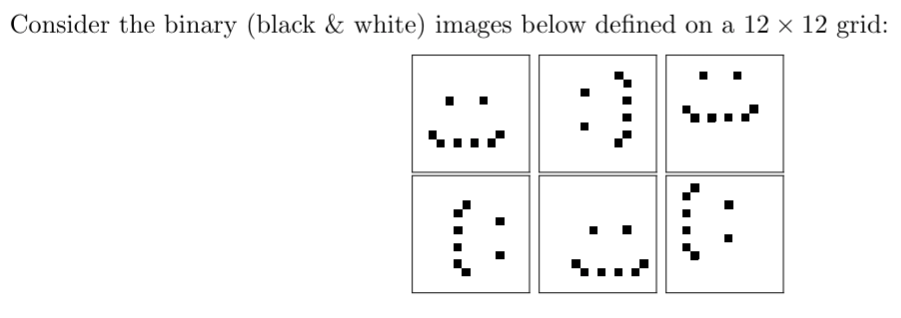

# Unsupervised Learning

## GMM

### Definitions

Given and unsupervised dataset $D=\{x_n\}$

- Define the GMM and describe the parameters
  - GMM aims at computing $P(x)$, the probability of generating a sample $x$
  - This probability can be expressed by defining a probability distribution which the samples obey to defined as a mixture of gaussians, namely $P(x)=\Sigma \pi_k N(x;\mu_k,\Sigma_k)$
  - The parameters of the model are:
    - The priors, proportional to how big the gaussians are
    - The mean of each gaussian
    - The covariance of each gaussian, a $d \times d$ matrix if $d$ is the input space
- Size of GMM if $K=3$ and $d=2$
  - 2 priors
  - 3 mean vectors, with 2 parameters each
  - 3 covariance matrices, with 3 independent parameters each
  - 17 in total

## PCA

### Black\white images

- Explain what is the dimensionality of the data space and what is the intrinsic dimensionality of the given
data
  - Dimensionality = 144
  - Intrinsic dimensionality = 3 (translation and rotation)
- Suppose you apply PCA on the data x1, . . . , x6 and find that the data can be fully described using M
principal components, namely u1, . . . , uM . Describe how the original data can be written in the space
defined by these M principal components
  - Taking the $n$-th sample $x_n$, we project it onto the reduced output space obtaining the following result: $<u_1^Tx_n, u_2^Tx_n, ..., u_M^Tx_n>$, namely the image is projected on each of the basis vectors of the output space ($u_iu_j=0$)
  - The directions of the basis vectors are obtained by maximising the variance of the projected vector, obtaining that $\lambda_j=u_j^TSu_j$
- Is M going to be equal to the number of intrinsic dimensions? Explain
  - Yes, M will be at least equal to 3, but the eigenvalues beyond that dimension probably will be zero, since there is no variance beyond translation and rotation in dataset

## Dimensionality Reduction

### What are latent variables and how do we use them

- We are in a un unsupervised setting, in which the dataset is made of $\{x_n\}$ without labels
- A way of describing the data when no labels are available is through GMM

### Describe the architecture of autoencoder and its purpose

- The purpose of an autoencoder is to represent data in a lower dimensional space while keeping relevant information
- More specifically, autoencoders overcome the difficulties of PCA in projecting data into a nonlinear latent space
- Let's suppose $x$ is our input
- An autoencoder is made of two neural networks:
  - Encoder: $x$ as input and $z$ as output, namely $x$ in the latent space
  - Decoder: $z$ as input and $x$ (same as input of encoder) as output
- $z$ is simply a vector
