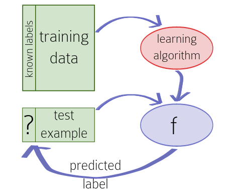
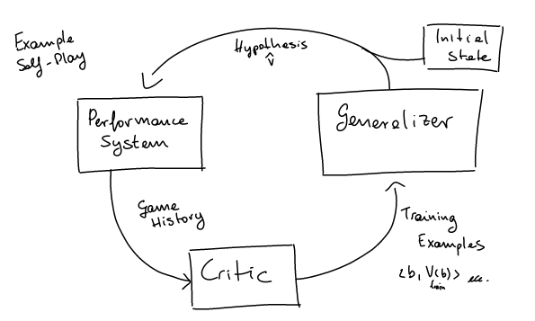

# What does it mean to learn?

## Generalization

Take for example a student which has to answer some questions on a test. Generalizing means that, if he saw some specific questions with the associated (corrected) answers, he is able to treat correctly new, unseen (related) questions.

But what does this mean in terms of Machine Learning?

## Induction

Take a recommender system. This system has to predict how much (on a scale) a student likes a course. The induction framework does this:

1. It looks at previous years' **examples** (course student pairs) taken from the so called **training set** and **induces** a function f that will map new examples to a **predicted** rating
2. It **evaluates** the induced function against the **test set**

Step 1 is contained in the red box, aka the learning algorithm. 

 Hi  

Hi
