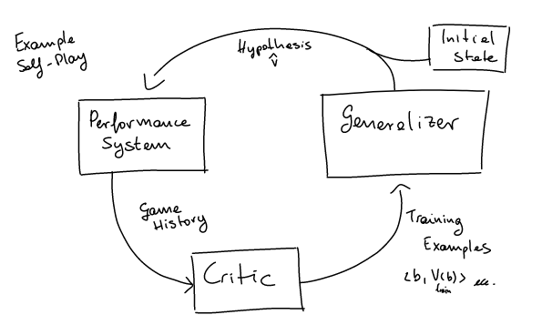

# What does it mean to learn?

## Intuitively

### Generalization

Take for example a student which has to answer some questions on a test. Generalizing means that, if he saw some specific questions with the associated (corrected) answers, he is able to treat correctly new, unseen (related) questions.

But what does this mean in terms of Machine Learning?

### Induction

Take a recommender system. This system has to predict how much (on a scale) a student likes a course. The induction framework does this:

1. It looks at previous years' **examples** (course student pairs) taken from the so called **training set** and **induces** a function f that will map new examples to a **predicted** rating
2. It **evaluates** the induced function against the **test set**

Step 1 is contained in the red box, aka the learning algorithm. It is executed as a cycle on all the training samples. In the figure below we zoom in.

## Formalizing

### Nomenclature

- The sample set is X and the samples are x
- The evaluation function is f
- The learned function is $ \hat f $
- The loss function is $ l(f,\hat f) $
- The dataset D and it's extracted from data distribution *D*
- The expected error $ \epsilon = \sum [D(x,f(x))*l(f(x),\hat f(x))] $, practically the expected value of l over distribution *D*

### Important concepts

- After having trained $ \hat f(x) $, we test it, hoping that $ \hat f(x) \approx f(x) \space \forall x \in X / D $
  - For that reason, the test set can never be taken from the training set. It is fundamental to avoid overfitting
- We usually differentiate every induction framework for three aspects
   1. How we represent the function (hypothesis space)
   2. How we evaluate the function (objective function)
   3. How we optimize the function (loss function)

## In one sentence

Supervised machine learning is the process of computing a function that has low expected error with reference to a loss function defined over a dataset
