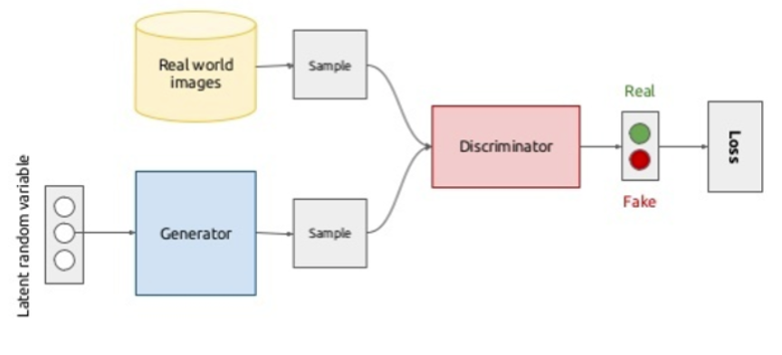

# Generative Adversarial Networks

- Focus is the generation of new smaples, more than the reconstruction from latent space

## Idea

- We still got two networks
  - Generator: input random value of $z$ from latent space, output an image
  - Discriminator: input real image from dataset and fake image from discriminator, output binary classification as REAL/FAKE
- Adversarial training:
  - Generator and discriminator try to fool each other
  - The generator outputs FAKE images trying to sell them as REAL
  - The discriminator tries to learn how to classify images REAL from FAKE, so it does good if the generator does bad
- Training
  - Train generator while fixing the discriminator and labeling the generator's images as REAL (and not using the dataset)
  - Train discimrinator while fixing the generator and labeling the generator's images as FAKE
- Goal
  - The losses of the two networks have to converge to an equilibrium (usually with discriminator at 0.5 accuracy)
