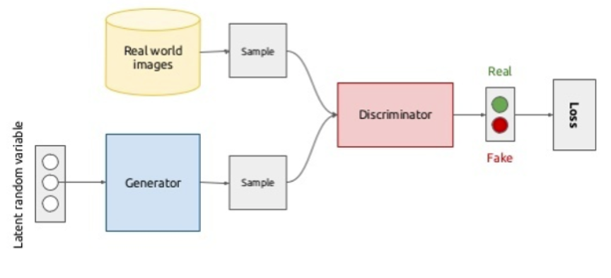

# Generative Adversarial Networks

## Intuition
- Focus is the generation of new samples, more than the reconstruction from latent space
- We do not use MLE
  - In the "default" loss function recipe, we use likelihood maximisation to update the network's parameters
  - Here parameters are update differently

## Idea
- We got two networks
  - Generator
    - Usually a CNN
    - Input: random value of $z$ from latent space
    - Output: an image in the image space
  - Discriminator
    - Is a classifier
    - Input: real image from dataset and fake image from discriminator
    - Output: binary classification as REAL/FAKE
- Discriminator does good if generator does bad
  - The generator outputs FAKE images trying to sell them as REAL
  - The discriminator tries to learn how to classify images REAL from FAKE

### Latent Space
- Representation of the manifold where real data lives
- Much simpler space than the one we use to represent data
#### How is the latent space initialized?
- Random noise
- At the start discriminator has an easy job

### What does it mean to do adversarial training?
- Train discriminator while fixing the generator and labeling the generator's images as FAKE
- Train generator while fixing the discriminator and labeling the generator's images as REAL (and not using the dataset)
- A real image will be labeled with 1 (positive) and fake image with 0 (negative)

### What does the loss look like?
#### Intuition
- The losses of the two networks have to converge to an equilibrium 
- This usually happens with discriminator at 0.5 accuracy
- Corresponds to image distribution and learned distribution (by the generator) being the same
#### Formulation
$V_1=\mathbb{E}_{x \sim p(x)}[log D(x)]$
- Maximum reward when class is correctly predicted
- Cross entropy
- Discriminator wants to maximise this

$V_2=\mathbb{E}_{z \sim q(z)}[log(1-D(G(z)))]$
- Expectation over distribution we control (from which we wanna learn $p(x)$)
- Discriminator wants to maximize this
  - If the discriminator works good $D(G(z))$ returns 1
- Generator wants to minimize this
  - It wants the discriminator to recognize generated images as real

#### Why is this not a likelihood?
- There are two targets
- We actually have two expectations (two value functions)

### What is Mode Collapse?
- Happens when G provides limited sample variety
- G could learn to produce the one output that always fools D
- Basically G is extromitting itself from z

## Wasserstein GANs
### Why?
- To solve mode collapse
- We wanna enforce that $p_G$ tends to $p_{data}$ but with a distance function

### What is the Wasserstein distance?
- It measures the distance between two probability distributions
  - Distance is measured in terms of probability mass needed to be moved from one distribution to the other
- The discriminator now is trained to learn a K-Lipschitz continuous function to help compute Wasserstein distance
- In continuous domain, it is expressed as the minimum (over all the
  possible joint probability distributions) expected distance between two samples
  - $W(p_r, p_g) = \min_{\gamma \sim \prod(p_r,p_g)} \mathbb{E}_{(x,y) \sim \gamma}[||x-y||]$

### How do we apply the wasserstein distance on GANs?
- The distance tells the gradient the directions in which the two
  distributions can become closer
- The loss function becomes wasserstein distance between the expected
  predictions over the real images and the expected predictions over the
  generated images
  - Of course this needs to be minimized
- We are not forcing the discriminator to be good anymore
  - So, there is no problem of mode collapse
