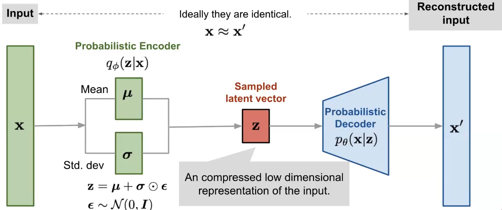

# Variational Autoencoders

## Goal
- Generate new samples that resemble original data distribution

## Why VAE?
- Plain autoencoders are good to do dimensionality reduction
- Plain autoencoders encode single data points
- **BUT** there is in general no direct implication from distance in latent space to similarity in input space
  - If two samples are near in the latent space, this does not mean they are similar in input space
  - There are no constraints imposed in how the latent space is learnt
  - $\implies$ autoencoders are not good to generate samples from data in latent space

## Idea
- Encoder produces a gaussian distribution instead of a simple vector
  - In practice the output is the mean and covariance of the gaussian distribution representing the latent space
- Decoder operates on samples from this distribution
- Our goal is to have $p_\theta(x)$ in order to do MLE
  - We could compute this if we had $p_\theta(z)$ by marginalization
  - **BUT** this integral is intractable

## How do we handle the computation of this integral?
- Input space is mapped into the latent space through $p_{\theta}(z)$
- Then we use fictituous posterior $q_{\phi}(z|x)$
  - Usually modeled as a gaussian
  - Parametrized by a neural network

## How does the loss look like?
- MSE + KL divergence factor
  - Distance from current latent space distribution $N(z;\mu,\Sigma)$ (or $p_{\theta}(z|x)$) to a nominal distribution $N(z;0,I)$ (or $q_{\phi}(z|x)$)
  - This distance is also weighted by a weight $\lambda$
- Practical problem: z sampling is not differentiable
  - Solved by reparametrizing
  - Sampling is done by $z=\mu+\Sigma \epsilon$ where $\epsilon$ is sampled from an "external" default distribution

## How does the whole VAE look like?

- Encoder outputs mean and variance of estimated latent prior
  - $\epsilon$ is sampled by fixed normal distribution
  - From this you get z
- Decoder learns distribution $p_\theta(x|z)$

## Why are VAEs better than GANs?
- You can't have mode collapse
- Because you learn distributions