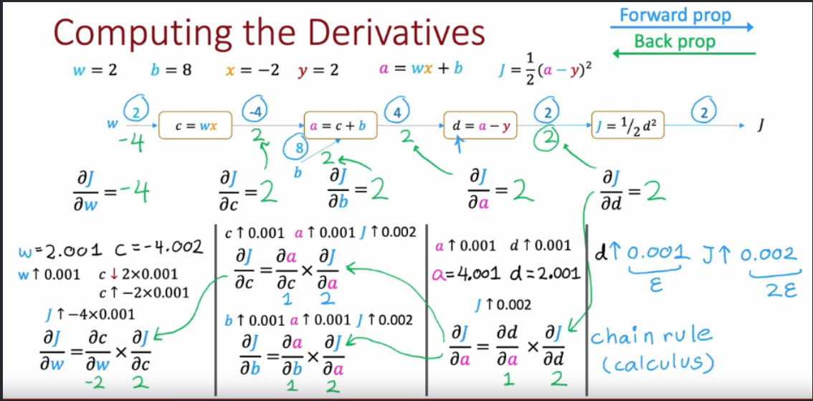

# Recipe for constructing loss functions

1) Choose a parametrized probability distribution over the outputs $P(y|x;\phi)$ $\rightarrow$ Likelihood Function
    - The network computes $\phi = f[x,\theta]$ where $\theta$ are network weights and biases
    - In general expressed as $L(\theta ; x, y) = \prod_i l(\theta;x_i,y_i) = \prod_i P(y_i|x_i;\theta)$ (all data samples are iid)
    - When $y$ are data labels the likelihood indicates how well the output probability distribution represents the data
2) Find the network parameters $\hat\theta$ that maximise the likelihood function $\rightarrow$ Maximum Likelihood Estimate
    - **Loss function** encourages each label to have high probability under the computed distribution, given the corresponding training input
    - In practive we take log of L, obtaining a sum of logs and minimize its negation, obtaining **NLL** loss function
    - $\hat \theta = \argmin_{\theta} (-\sum_i \log[P(y_i|x_i;\theta)]) = \argmin_{\theta} (J(\theta))$
    - That we achieve with stochastic gradient descent
3) For inference, we return either the whole distribution $P(y|x;\phi)$ or a point estimate taking the maximum

## Examples

- Univariate Regression
  - Goal : predict a single scalar output based on some features
  - Likelihood : gaussian with mean computed by the network $\rightarrow$ $L(\theta;x,y) \propto \prod_i exp (-(y_i - \theta^T x_i)^2) $
  - Loss Function : negative log of L $\rightarrow$ $J(\theta) \propto - \sum_i \log (exp (-(y_i - \theta^T x_i)^2))$
    - Finally $J(\theta) = \sum_i (y_i - \theta^T x_i)^2$

- Binary Classification
  - Goal : predict 0 or 1 based on some features
  - Likelihood : probability mass function of the Bernoulli distribution
    - $L(\theta;x,y) = \prod_i ([P(y_i=1|x_i)]^{y_i} \times [1-P(y_i=1|x)]^{1-y_i})$
    - Intuitively, probability of observing as outcome of a bernoulli trial label 0 or 1 when observing a data point4
    - $P(y=1|x) = \sigma(\theta^T x)$ where $\sigma$ is the sigmoid function
  - Loss Function : $J(\theta) = -log(P(y|x;\theta))$

- Multiclass Classification
  - Goal : predict correct class among k
  - Likelihood : probability mass function of the categorical distribution
    - $L(\theta;x,y) = softmax_k(f[x,\theta])$

## Cross Entropy Loss

- Measures dissimilarity between empirical (sample) distribution and real distribution
- Can be interpreted as maximizing the probability of the true class at the expense
of all other outputs

## Backpropagation (Core of SGD)

### Intuition on derivatives

- $ w \uparrow \epsilon $ (w increases of $\epsilon$) causes $J(w) \uparrow k\epsilon$ $\implies$ $\frac{\partial J}{\partial w} = k$
- Small derivative means small change in $w$
  - In fact in this case, changing $w$ doesn't change that much J
- The derivative on each variable tells you the sensitivity of the whole expression on its value.

### Computational graph

- When we do a forward propagation, we have to compute the gradient in order to optimize
- That is achieved by doing backprop, which means unwinding the prediction by doing chained derivatives

  
