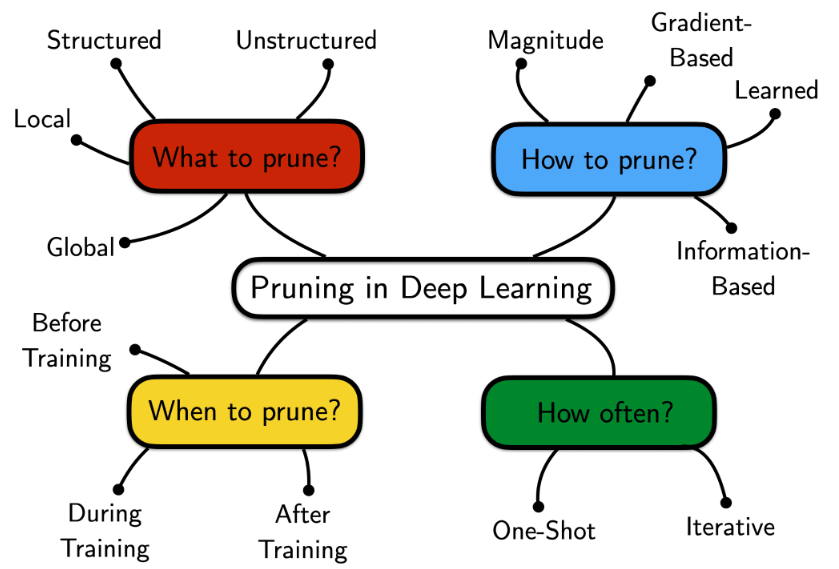

# Model Compression

# What is Pruning?
- In general it means cutting away weights or neurons of the neural networks
### Why?
- Training is costly
- Hardware is costly
- Time is money
### How do you prune?

### Does it matter to retrain after pruning some weights?
- Yes
- With retraining you can prune up to 95% by losing not too much accuracy
## Unstructured Pruning
- Remove least important neurons (the ones with very low weights)
- Finetune
- Repeat
### Problems?
- Does not leverage modern GPUs
## Structured Pruning
- Reduce some dimensions
## Lottery Ticket Hypothesis
- Having a randomly-initialized unpruned neural network
- There exists some subnet that
- When trained for at most K iterations
- Gains the same accuracy on the test set as the whole network
### What is the winning lottery ticket?
- the subnet that generalizes as much as the whole network
### How do you look for the winning ticket?
- The weights $\theta_0$ at random initialization are stored
- Train a network for $j$ iterations, arriving at weights $\theta_j$
- Prune some parameters, creating a mask $m$
- Reset the remaining parameters to $\theta_0$
- Repeat
### What is the intuition behind this?
- I am searching for the winning ticket among the ones I had at the start
- The loss does not change, it is simply projected on the new dimension (with fewer parameters)
- So, some directions are ignored
### What is the final outcome?
- There exists a masking matrix $m$
- For which training takes less time
- For which accuracy is higher
- For which the network has fewer parameters

# Quantization

## Main Idea
- Store weights using lower-precision data types
  - Floating point number becomes INT8 or INT4
  - But how can we not loose accuracy?
- Two types:
  - **Post-Training Quantization**
  - **Quantization Aware Training**

### Quantization Scheme
- Usage of floating point during training but integer only during inference
- Main goal:
  - Find a mapping from real domain to quantized domain
  - $r$ is real number and $q$ is quantized number
  - $r = S(q-Z)$ where $S$ is scale and $Q$ is the zero-point (center of the distribution of the quantized values)
    - $S$ and $Q$ are parameters to be found

### How do you do inference on a quantized model?
- You apply quantization formula on inputs and weights
- You transform products into shift operations

### How do you train a quantized model?

