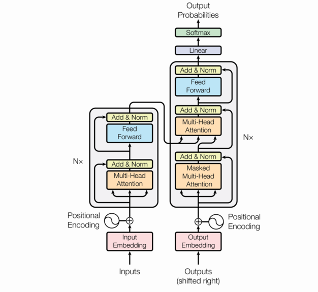

# Transformers

## Intro
- Why?
  - CNNs are not able to grasp features in data where:
    - Locality does not hold anymore
    - Shaped as a sequence
    - In variable size and resolution
- Premise
  - We got a series of tokens $x_1,...,x_n$ where $x_i \in \R^d$
  - A convolutional layer would compute $h_i=\Sigma_j w_j x_{i+j}$
    - $j=-k...k$ with $k$ fixed

## What is the output of the [attention](transformers_intuitive.md/#attention) mechanism?
- A matrix $A \sim (n, o)$
  - $n$ is the input dimension (number of tokens)
  - $o$ is the output dimension (number of tokens)
- Each column of this matrix represents how much importance each output token
  gives to the input token at the corresponding dimension
- Mechanism is produced by the so-called **scoring function**

## What was used before transformers?
- Recurrent neural networks
- We generate an output sequence y from an input sequence x
- The hidden state for the encoder at time t contains also $c_t$, the context vector

### What is the context vector?  
- $c_t$ is a weighted sum of hidden states

### How are the weights computed?
- With a softmax-normalized scoring function
- The higher the alignment between decoder hidden state at time $t-1$ and encoder hidden state at time $t$, the higher the score

## What is an embedding?
- Representation of high-dimension categorical data into a smaller continuous vector space
- Usually it is a dense representation of a data distribution
- Two reasons:
  - Capture semantic relationships
  - Reduce computational complexity

## How do we know where each token is?
- Positional encoding

## What role does the encoder have in classical transformers?
- In the context of translation
- Encode the input into a more meaningful representation

## What does the decoder do?
- Decode the encoding
### What is masking in the decoder?
- Way of making the decoding causal
- Every token looks at attention scores only for past tokens

## What is self attention?
- A self-attention layer computes a scalar weight with **attention scoring function** $\alpha(x_i,x_j)$
  - Measures how much weight token $i$ gives to token $j$
  - All weights for token $i$ are normalized with softmax so that they sum to 1: introduces bias of **soft sparsity**: few dependencies are considered but not in a fixed way
  - Does not consider position of the token, but just the token itself
- Why **self?**
  - Because source and target sequence are the same
- For token i the output is $h_i = \Sigma_j softmax(\frac{q_i^Tk_j}{\sqrt d})v_j$
  - Trainable parameters are matrices $W_q, W_k, W_v$ such that $q_i=W_q^Tx_i$ and $k_i=W_k^Tx_i$ and $v_i=W_v^Tx_i$
  - Parameters depend only on embedding dimension and on size of $k,v,q$
  - $v$ determines the output shape
  - Operator is permutation invariant, so the order of tokens does not matter
- Parallelism to dictionary
  - Python structure made of tuples of keys and values
  - We can query the dictionary searching for a key
  - The self-attention operator is a "soft" dictionary that outputs values based on the similarity between a key and a query
  - It's called self because keys, queries and values all come from the same token
- What if we have $n$ embeddings?
  - The output is a generic $H \in \R^{n \times d}$ matrix
  - $d$ is the embedding dimension

## Multi-head attention

- What?
  - We have multiple attention operators, where each one is a head
  - So we'll have $h \times 3$ parameter matrices
- Why?
  - We are hoping that we are able to capture a different dependency for every head
  - Scaling is good for larger datasets
- How?
  - We stack horizontally every $H_k$ with $k=1...h$
  - $H = [H_1 ... H_h] W_o$
- What are the hyperparameters?
  - Embedding size $d$
  - Output size $o$
  - Number of heads $h$

## Wrapping up: the transformer block

### Transformer for forecasting (just the encoder)
- Two phases
  - Phase 1: token mixing with multi-head attention layer and layer normalization
  - Phase 2: per-token update (just like a 1x1 convolution) which acts as feature extractor for each token
- Between one phase and another the output is always a matrix $N \times d$ where $d$ has to always remain the same because of the residual connections

### Transformer for machine translation (the original one)
- Encoder encodes
- Decoder decodes
- Softmax on top of the decoder
- No surprises