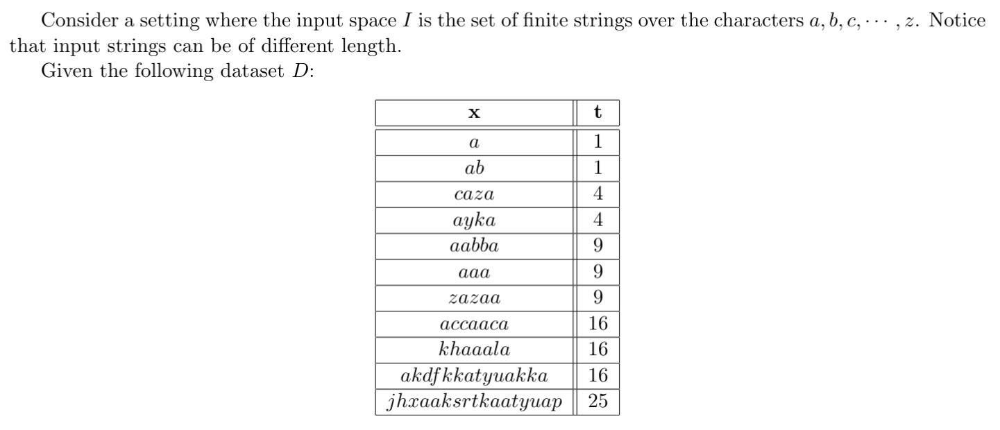

# Linear Models

## Linear Regression

### Dataset of tuples $(x_n, t_n)$ where $x_n \in R^3$ and $t_n \in R$

- Provide the definition of linear regression with parameters $w$ for estimating a non-linear function $y$
  - $w$ is 4-dim (bias in pos 0)
  - Inference: $\hat y(x)=\Sigma_k w_k\cdot \phi(x_k)$ with $k = 0,1,2,3$
- Provide a suitable loss function and sketch an algorithm for estimating the parameters of the model
  - $E(w)=\frac{1}{2}\Sigma_n (y(x) - \hat y(x))^2$
    - We could also add regularization term $E_w(w) = \frac{1}{2}w^tw$ to $E(w)$ to penalize high weights and avoid overfitting
  - Sequential learning, namely following the negative gradient
    - $w \leftarrow w + \eta \phi(x_n)(y(x_n)-\hat y(x_n))^2$
    - Heavily depends on learning rate

### Basic Definitions

- Explain the difference between regression and classification
  - The difference lies mainly in the function to learn
  - With regression we have a real valued $f: x \rightarrow \R$
  - While with classification (k-class classification to be general) we have $f: x \rightarrow \{C_1,...,C_K\}$
  - So in the first case we have a real number as label, while in the second a K-long vector with all but the k-th element equal to zero, where k is the class which the training sample belongs to
- Provide a mathematical formulation of linear regression
  - As stated above, the function to learn is $f: x \rightarrow \R$
  - If the prediction model is linear, this means that it outputs some value $y(x)=w^Tx$ where $w \in \R^{d}$ is a vector of weights and $x \in \R^d$ is a vector of features
  - We can measure the performance of the prediction through a loss function over a dataset $D=\{x_n,t_n\}$ defined as the mean squared the error between predictions and labels: $J(w)=\frac{1}{2}\Sigma_n (t_n-y(x_n))^2$
  - The training makes use of the loss in an iterative manner, namely at each training iteration the weights are changed such that $w \leftarrow w - \eta \nabla J(w)$ where $\eta$ is the learning rate
- Overfitting in linear regression and how it can be mitigated
  - Situation in which x is 1-dim
  - Plot of 9 points dataset that is fitted with a 9 dimensional prediction function

## Linear Classification

### Logistic Regression Basic Definition

- Define mathematically the problem of logistic regression
  - Logistic Regression solves a problem of binary classification
  - It means learning a function $f: \R^d \rightarrow \{C_1,C_2\}$
  - More specifically, logistic regression has to find the weights $w$ so that $\sigma(w^Tx)$ fits the data, where $\sigma(z)=\frac{1}{1+exp(-z)}$ is the logistic function

## Kernel Methods

### Basic Definition

- Give a short explanation of the kernel trick. What is necessary condition for applying the kernel trick?
  - Excursus, without Kernel Trick:
    - Error function: $E(w)=(t-Xw)^T(t-Xw)$ where $X$ has samples on $N$ rows and $t$ is the column vector of $N$ labels
    - Solution to error minimization: $w^*=(X^TX)^{-1}X^Tt \in \R^{d \times 1}=X^T(XX^T)^{-1}t=X^T\alpha$
    - In the end $\alpha=K^{-1}t$ where $K \in \R^{N \times N}$ is the Gram matrix where element $(i,j)$ is the dot product between sample $i$ and $j$
    - So the linear model is rewritten as $y(x)=\Sigma (\alpha_nx_n^Tx)$
  - The Kernel Trick consists in substituting to the dot product in the inference phase, a different operation that gives a similarity measure between the two vectors
  - The necessary condition for it to be applicable is that the two vectors ($x_n$ and $x$) have to appear in a dot product, that $k \geq 0$ and that $k$ is symmetric

### Strings

- Identify the learning problem at hand, in particular the form of the target function, and define a suitable
linear model for it
  - Regression problem, with target function $f: \N^{26} \rightarrow \N$
    - Input features $\phi(x)$: vector with occurences of each letter in the string
      - actually $\phi(x)=x^Tx \implies$ each entry squares the number of occurences
    - Output: linear model $y(x)=w^T\phi(x)$
    - Thus, $w$ will be simply one-hot, with 1 corresponding to THE letter
  - But, to be more general, we could also consider simply the string $x$ as input and the linear model would be $y(x) = w^Tx$
    - Let's suppose we had a design matrix of strings (no feature map applied) $X \in \R^{N \times 1}$
  - Without Kernel Trick:
    - Error function: $E(w)=(t-Xw)^T(t-Xw)$ where $X$ has samples on $N$ rows and $t$ is the column vector of $N$ labels
    - Solution to error minimization: $w^*=(X^TX)^{-1}X^Tt \in \R^{d \times 1}=X^T(XX^T)^{-1}t=X^T\alpha$
    - In the end $\alpha=K^{-1}t$ where $K \in \R^{N \times N}$ is the Gram matrix where element $(i,j)$ is the dot product between sample $i$ and $j$
    - So the linear model is rewritten as $y(x)=\Sigma (\alpha_nx_n^Tx)$
- Apply the kernel trick to the model defined above and provide the analytical form of the corresponding
error function
  - Kernel trick: apply the same function $k(x_i,x_j)$ to each element of $K$, namely we use a different method than dot product to measure the similarity of two vectors
    - Model becomes $y(x;\alpha)=\Sigma (\alpha_n k(x_n,x))$
    - Error function becomes $E(\alpha) = \frac{1}{N}\Sigma E_n(\alpha)$ where $E_n(\alpha)=$
  - Two main advantages:
    - The model is still linear, but the function is nonlinear
    - We can apply this method also to data not representable as vectors
- Define the solution obtained with your choices for the dataset D
  - We may use as kernel function $k(x_n,x)= |count_a(x_n)-count_a(x)|$
    - $k$ should be real valued, positive and simmetric
  - $\alpha^*=K^{-1}t$ is the solution (without regularization)
