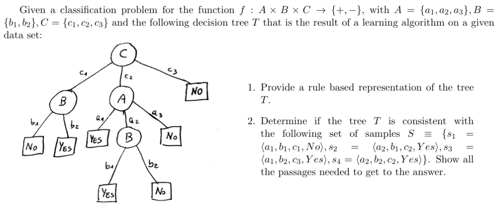

# Non parametric learning

## Decision trees

### Tree to rule

- Rule system:
  - if C is c3 return NO
  - if C is c2 AND A is a1 return YES
  - if C is c2 AND A is a2 AND B is b1 return YES
  - ecc...

- Check for consistency
  - Not consistent because of s3
  - We just have to check the rules
