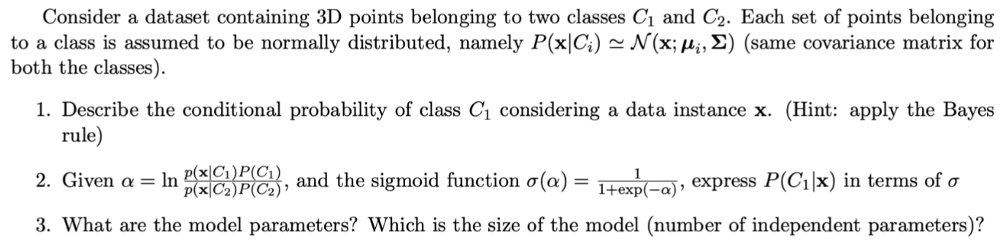

# Probabilistic interpretation of Learning

## Maximum likelihood hypothesis

- Provide a formal definition
  - Premise: we are in the context of parametric models, where the goal is to learn a function $f$ with a model $\phi = g[x,\theta]$. The input is $x$, $\theta$ are the parameters of the model and  $\phi$ are the parameters of the probability distribution $P(y|x;\phi)$
  - This probability distribution tells us how likely a value y is, given the input x, based on the parameters $\phi$. This probability distribution is the likelihood function.
  - Given this information, the maximum likelihood hypothesis states that maximising this likelihood function

## Maximum a Posteriori hypothesis

- Provide a formal definition
  - $h^* = \argmax_h P(h|D)$
- Provide a formal definition of Optimal Bayes Classifier
  - $y = \argmax_{y_k} \Sigma_h P(y_k|h)P(h|D)$

## Secret strings

- A secret string s = $b_0b_1b_2b_3$ of 4 bits fulfills the following constraints
  - if $b_0 = 0$, s contains an even number of 0’s and 1’s
  - if $b_0 = 1$, s contains at least three 1’s

- Define the prior probability distribution $P(s)$ of the hypothesis string s
  - $P(s)=\frac{1}{7}$
- Assuming $b_0 = 0$, define the conditional probability distribution $P(s|b0 = 0)$ and indicate all maximum
a-posteriori hypotheses
  - $P(s|b_0 = 0) = P(b_0 = 0|s)P(s)=\frac{3}{7}\frac{1}{7}$
  - The MAP hypotheses are the ones that are possible when the first bit is 0
- Assuming b0 = 1 and b1 = 1, indicate all maximum likelihood hypotheses and compute the likelihood
that b2 = 1

## Generative model

Consider a dataset D for the binary classification problem $f: \R^3 \rightarrow \{A,B\}$

- Describe a probabilistic generative model for such a classification problem, assuming Gaussian distributions
  - In a generative model for classification, we predict the class by computing the posterior probability distribution $P(C_i|x)$ from the class-conditional densities $P(x|C_i)$
  - This means the model first learns how to generate a sample $x$ given it has to be of a certain class
    - From Bayes rule: $P(C_i|x)=\frac{P(x|C_i)P(C_i)}{P(x)}=\frac{ln(P(x|C_i)P(C_i))}{\Sigma(ln(P(x|C_j)P(C_j)))}=\frac{a_i}{\Sigma a_j}$
    - Normalizing (softmax): $P(C_i|x)=\frac{exp(a_i)}{\Sigma exp(a_j)}$
    - We assume that $P(x|C_i)$ is a normal distribution with mean $\mu_i$ and covariance $\Sigma$ and that the prior $P(C_i)=\pi_i$, which has two implications:
      - $a_i$ becomes linear in $x$ and the $w$ vector obtained with the gaussian's parameters (that's true for all exponential class-conditional densities)
      - gaussian's parameters of $P(x|C_i)$ obtained through maximum likelihood estimation
  - In the end the sample $x$ is classified by taking the maximum among $P(C_i|x)$
- Identify the parameters of the model and determine the size of the model (i.e., the number of independent
parameters)
  - The parameters are those of the gaussians
  - The size is in total 13:
    - 1*1 for $\pi_i$
    - 2*3 for $\mu_i$
    - 6 for $\Sigma$

## Sigma

1. $P(C_1|x)=\frac{P(x|C_1)P(C_1)}{P(x)}=\frac{P(x|C_1)P(C_1)}{P(x|C_1)P(C_1)+P(x|C_2)P(C_2)}$

- We could in theory compute this if we had the the prior probabilities and the class conditional densities
- The goal of a generative model is to compute the parameters necessary to obtain the class conditional densities and then compute the posterior through Bayes Rule as stated above

2. $P(C_1|x)=\frac{1}{1+\frac{P(x|C_2)P(C_2)}{P(x|C_1)P(C_1)}}=\frac{1}{1+\exp(\ln(\frac{P(x|C_2)P(C_2)}{P(x|C_1)P(C_1)}))}=\frac{1}{1+\exp(-\ln(\frac{P(x|C_1)P(C_1)}{P(x|C_2)P(C_2)}))}=\frac{1}{1+\exp(-\alpha)}$

- So we stated that the posterior obeys a sigmoid distribution with variable $\alpha$. How can this help us? How do we estimate the gaussian parameters?
- First question: ff we substitute gaussian distribution to $P(x|C_i)$ in $\alpha$ and do computations, we would get that $\alpha$ is a linear combination, so $\alpha=w^Tx$, where $w$ is function of the gaussian's parameters. This means the posterior is a sigmoid of a linear function.
- Second question: maximum likelihood, so we maximise the likelihood based on the Bernoulli distribution (generalized by the categorical distribution with multiple classes) $P(t|\pi_k,\mu_k,\Sigma) = \Pi_n \Pi_k [\pi_k N(x_n;\mu_k,\Sigma)]^{t_{nk}}$ where $t_n$ is a one-hot encoded vector
  - We obtain the parameters of the gaussians by computing $\argmin -log(P(t|\pi_k,\mu_k,\Sigma))$
- In the end we predict the class of a new sample simply by taking $\argmax_i(P(C_i|x))$

3. The model parameters are the gaussians parameters and the priors. So the dimension is:

- 1 prior
- 2 means
- 6 for covariance (3x3 matrix but just 6 independent parameters because of simmetry)