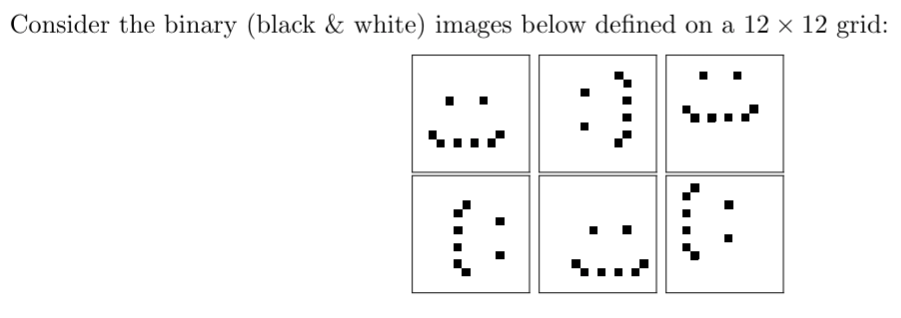

# Unsupervised Learning

## PCA

### Black\white images

- Explain what is the dimensionality of the data space and what is the intrinsic dimensionality of the given
data
  - Dimensionality = 144
  - Intrinsic dimensionality = 3 (translation and rotation)
- Suppose you apply PCA on the data x1, . . . , x6 and find that the data can be fully described using M
principal components, namely u1, . . . , uM . Describe how the original data can be written in the space
defined by these M principal components
  - Taking the $n$-th sample $x_n$, we project it onto the reduced output space obtaining the following result: $<u_1^Tx_n, u_2^Tx_n, ..., u_M^Tx_n>$, namely the image is projected on each of the basis vectors of the output space ($u_iu_j=0$)
  - The directions of the basis vectors are obtained by maximising the variance of the projected vector, obtaining that $\lambda_j=u_j^TSu_j$
- Is M going to be equal to the number of intrinsic dimensions? Explain
  - Yes, M will be at least equal to 3, but the eigenvalues beyond that dimension probably will be zero, since there is no variance beyond translation and rotation in dataset
